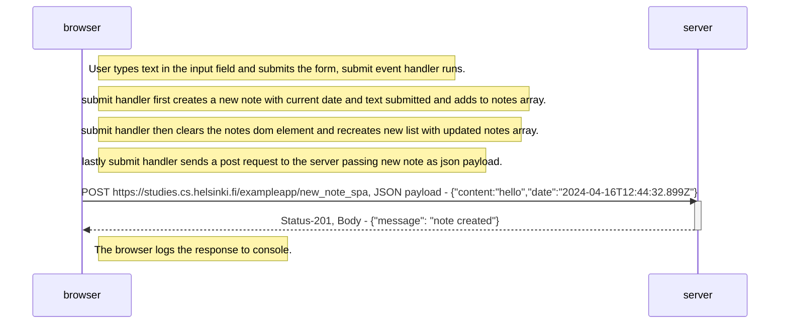

```mermaid
sequenceDiagram
participant browser
participant server

    Note right of browser: User types text in the input field and submits the form, submit event handler runs.

    Note right of browser: submit handler first creates a new note with current date and text submitted and adds to notes array.

    Note right of browser: submit handler then clears the notes dom element and recreates new list with updated notes array.

    Note right of browser: lastly submit handler sends a post request to the server passing new note as json payload.

    browser->>server: POST https://studies.cs.helsinki.fi/exampleapp/new_note_spa, JSON payload - {"content:"hello","date":"2024-04-16T12:44:32.899Z"}
    activate server
    server-->>browser: Status-201, Body - {"message": "note created"}
    deactivate server

    Note right of browser: The browser logs the response to console.
```
